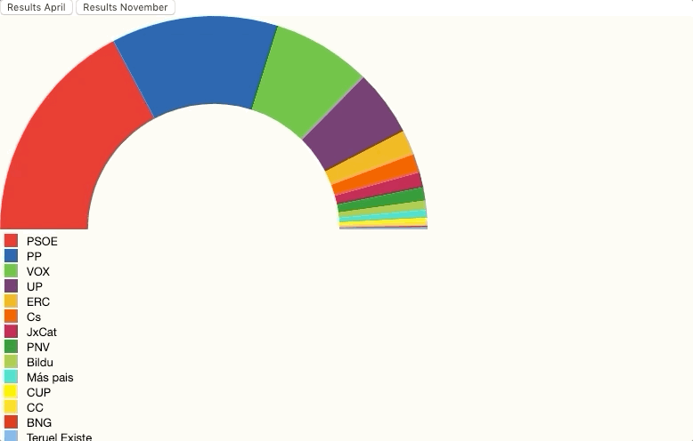

# Multiple Series

One more request from your boss... _Hey ! I want to be able to compare results with the previous elections ones, just by clicking on a
button swap values and btw. I would like to show some transition when swapping data sets_

Something like:



Live demo: [codesandbox](https://codesandbox.io/s/frosty-waterfall-j47s5)

# Steps

- We will take as starting sample _04-pimp-chart_.

- Let's copy the content from _04-pimp-chart_ and execute _npm install_

```bash
npm install
```

- Let's add two buttons in the _index.html_ file:

_./src/index.html_

```diff
  <body>
+    <div>
+      <button id="april">Results April</button>
+      <button id="november">Results November</button>
+    </div>
    <script src="./index.ts"></script>
  </body>
```

- Let's import April's result and _ResultEntry_ entity:

```diff
import * as d3 from "d3";
import {
  resultCollectionSpainNov19,
+  resultCollectionSpainApr19,
  ResultEntry
} from "./data";
```

- In April's election there's a political party that is not in novembers election, we need to include all parties:

```diff
const partiesColorScale = d3
  .scaleOrdinal([
    "#ED1D25",
    "#0056A8",
    "#5BC035",
    "#6B2E68",
    "#F3B219",
    "#FA5000",
    "#C50048",
    "#029626",
    "#A3C940",
    "#0DDEC5",
    "#FFF203",
    "#FFDB1B",
    "#E61C13",
    "#73B1E6",
+    "#FFA500"
  ])
  .domain([
    "PSOE",
    "PP",
    "VOX",
    "UP",
    "ERC",
    "Cs",
    "JxCat",
    "PNV",
    "Bildu",
    "Más pais",
    "CUP",
    "CC",
    "BNG",
    "Teruel Existe",
+    "Compromis",
  ]);
```

- Let's add a method to swap the data we are using (e.g. swap november results with april results),
  we will append all this code at the end of the index.ts file:

_./src/index.ts_

```typescript
const updateChart = (data: ResultEntry[]) => {
  d3.selectAll("path")
    .data(pieChart(<any>data))
    .transition()
    .duration(500)
    .attr("d", <any>arc);
};
```

- And now call them on each button with the corresponding data:

```typescript
document
  .getElementById("april")
  .addEventListener("click", function handleResultsApril() {
    updateChart(resultCollectionSpainApr19);
  });

document
  .getElementById("november")
  .addEventListener("click", function handleResultsNovember() {
    updateChart(resultCollectionSpainNov19);
  });
```

- Let's give a try...

```bash
npm start
```

- We got an animation but a bit strange, how to make it smoother? remove the sorting:

```diff
const pieChart = d3
  .pie()
  .startAngle(-90 * (Math.PI / 180))
  .endAngle(90 * (Math.PI / 180))
  .value(d => d["seats"])
+  .sort(null);
```

- Now looks better, it still not perfect you can work it out to get it perfect by following this example: https://bl.ocks.org/tezzutezzu/c2653d42ffb4ecc01ffe2d6c97b2ee5e

# Excercise

Let's implemnent a "pactometer", just only for the current November election process, add a checkbox per political party, the users can check which parties reach an agreement and
check if the get absolute parliamentary majority.

Tips:

- Add manual checkbox.
- Start by creating two keys: Pact, Others.
- Sum up Pact, Sum up others.
- Display the semi arch chart.
- Now let's go one step forward:
  - Keep all the parties in the pact (all the keys).
  - Create a key call others (gray color) where you sum up all the other seats.
- Display the semi arch chart.

# About Basefactor + Lemoncode

We are an innovating team of Javascript experts, passionate about turning your ideas into robust products.

[Basefactor, consultancy by Lemoncode](http://www.basefactor.com) provides consultancy and coaching services.

[Lemoncode](http://lemoncode.net/services/en/#en-home) provides training services.

For the LATAM/Spanish audience we are running an Online Front End Master degree, more info: http://lemoncode.net/master-frontend
